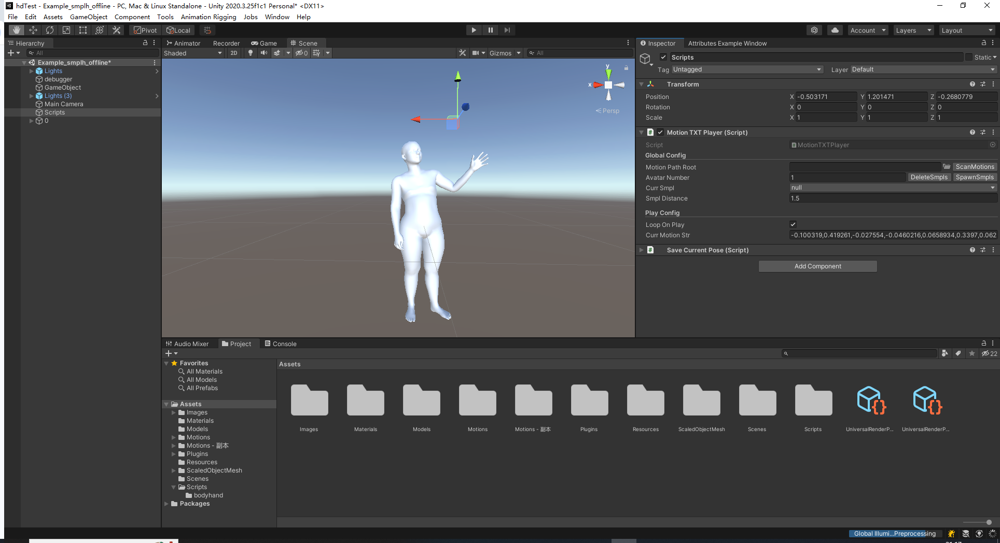

# BOTH2Hands
The official implementation of the paper "[BOTH2Hands: Inferring 3D Hands from Both Text Prompts and Body Dynamics](https://arxiv.org/abs/2312.07937)".

For more results and details, please visit our [webpage](https://godheritage.github.io/BOTH2Hands/).

# Instructions
This code was tested on Ubuntu `20.04.6 LTS`.
## 1. Setup environment
### 1.1 Create environment
```shell
conda env create -f both2hands.yaml
conda activate both2hands
```
### 1.2 Install Mesh
Clone [MPI-IS mesh](https://github.com/MPI-IS/mesh) , and use pip install locally: 
```shell
cd path/to/mesh/folder
```

If you have issues, check this [issue](https://github.com/MPI-IS/mesh/issues/89).

### 1.3 Install human body prior
Clone [human body prior](https://github.com/nghorbani/human_body_prior) , and install locally: 
```shell
cd path/to/human_body_prior/folder
python setup.py develop
```

### 1.4 Install SMPL+H model
Download [SMPL+H model](https://mano.is.tue.mpg.de/download.php), and extract folder here:
- body_model
    - smpl_models
        - smplh
          - neutral
          - ......

## 2. Get data
Please read [follow section](#both57m-dataset) to fetch full BOTH57M data. Then collect data like "dataset/ExampleDataset/ExampleDataset.p" using joblib, and put your dataset like this:
- dataset
    - ExampleDataset
        - ExampleDataset.p
    - YourDataset
        - YourDataset.p

## 3. Run Code
### 3.1 Training your model
```shell
python main.py --config train.yaml
```
### 3.2 Generate motions
Download [model checkpoints](https://drive.google.com/file/d/13P34bElETwf5gAGSzAvKp19UN-zkdADz/view?usp=sharing) and put it here:
- checkpoints
    - example
      - both2hands_example.ckpt
  
```shell
python main.py --config gen.yaml
```
We currently only provide [unity visualization methods](https://drive.google.com/file/d/1ci0GYSMjg00M5RSywf2K9sIS5fJJ7hc8/view?usp=drive_link), which is easy to use. The project is tested on `Unity 2020.3.25`.


### 3.3 Evaulation
Download [model checkpoints](https://drive.google.com/file/d/13P34bElETwf5gAGSzAvKp19UN-zkdADz/view?usp=sharing)  and put it here:
- checkpoints
    - example
      - both2hands_example.ckpt

Download [encoder checkpoints](https://drive.google.com/file/d/1nri9a-_3Rwd6eOzmmPNr_DuLx2GPSVma/view?usp=drive_link) and put it here:
- eval_encoder
  - encoder.pth

```shell
python main.py --config eval.yaml
```

# BOTH57M Dataset


The dataset is available on [Here](https://drive.google.com/file/d/1PNC3We9HTUA-TvAIb_M4TKhVe_4Ztye3/view?usp=drive_link) and requires the password to unzip the file. Please carefully read, fill in the [license form](./readme/license.pdf), and send it to Lan Xu (xulan1@shanghaitech.edu.cn) to request access.

By requesting access to the content, you acknowledge that you have read this agreement, understand it, and agree to be bound by its terms and conditions. This agreement constitutes a legal and binding agreement between you and the provider of the protected system or content. The Visual & Data Intelligence(VDI) Center of ShanghaiTech University is the only owner of all intellectual property rights, including copyright, of BOTH57M DATASET, and VDI reserves the right to terminate your access to the dataset at any time.

Notes:

(1) Students are **NOT** eligible to be a recipient.  If you are a student, please ask your supervisor to make a request.

(2) Once the license agreement is signed, we will give access to the data.

(3) Dataset including RGB data is Large (3.4T), please prepare your storage space.
# Licenses
<a rel="license" href="http://creativecommons.org/licenses/by-nc-sa/4.0/"></a><br />This work is licensed under a <a rel="license" href="http://creativecommons.org/licenses/by-nc-sa/4.0/">Creative Commons Attribution-NonCommercial-ShareAlike 4.0 International License</a>.

# Citation 
Please consider citing our work if you find this repo is useful for your projects.

```bibtex
@inproceedings{zhang24both,
    title = {BOTH2Hands: Inferring 3D Hands from Both Text Prompts and Body Dynamics},
    author = {Zhang, Wenqian and Huang, Molin and Zhou, Yuxuan and Zhang, Juze and Yu, Jingyi and Wang, Jingya and Xu, Lan},
    booktitle = {Conference on Computer Vision and Pattern Recognition ({CVPR})},
    year = {2024},
}
```
## Acknowledgment
The code is built based on [EgoEgo](https://github.com/lijiaman/egoego_release). Please check their projects if you are interested in body conditioned motion diffusion.
