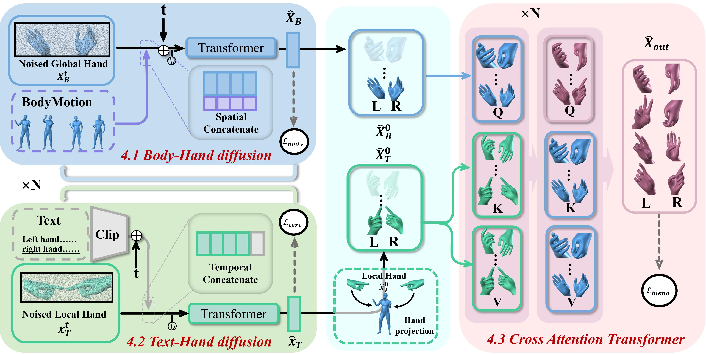

# BOTH2Hands
The official implementation of the paper "[BOTH2Hands: Inferring 3D Hands from Both Text Prompts and Body Dynamics](https://arxiv.org/abs/2312.07937)".

For more results and details, please visit our [webpage](https://godheritage.github.io/).

# Code coming soon!
Please star the project to get the latest news ⭐
# BOTH57M Dataset
The dataset is available on [Here](https://drive.google.com/file/d/1PNC3We9HTUA-TvAIb_M4TKhVe_4Ztye3/view?usp=drive_link) and requires the password to unzip the file. Please carefully read, fill in the [license form](./readme/license.pdf), and send it to Wenqian Zhang (zhangwq2022@shanghaitech.edu.cn) and cc Lan Xu (xulan1@shanghaitech.edu.cn) to request access.

By requesting access to the content, you acknowledge that you have read this agreement, understand it, and agree to be bound by its terms and conditions. This agreement constitutes a legal and binding agreement between you and the provider of the protected system or content. The Visual & Data Intelligence(VDI) Center of ShanghaiTech University is the only owner of all intellectual property rights, including copyright, of BOTH57M DATASET, and VDI reserves the right to terminate your access to the dataset at any time.

Notes:

(1) Students are **NOT** eligible to be a recipient.  If you are a student, please ask your supervisor to make a request.

(2) Once the license agreement is signed, we will give access to the data.
# Licenses
<a rel="license" href="http://creativecommons.org/licenses/by-nc-sa/4.0/"></a><br />This work is licensed under a <a rel="license" href="http://creativecommons.org/licenses/by-nc-sa/4.0/">Creative Commons Attribution-NonCommercial-ShareAlike 4.0 International License</a>.

# Citation 
Please consider citing our work if you find this repo is useful for your projects.

```bibtex
@inproceedings{zhang24both,
    title = {BOTH2Hands: Inferring 3D Hands from Both Text Prompts and Body Dynamics},
    author = {Zhang, Wenqian and Huang, Molin and Zhou, Yuxuan and Zhang, Juze and Yu, Jingyi and Wang, Jingya and Xu, Lan},
    booktitle = {Conference on Computer Vision and Pattern Recognition ({CVPR})},
    year = {2024},
}
```

